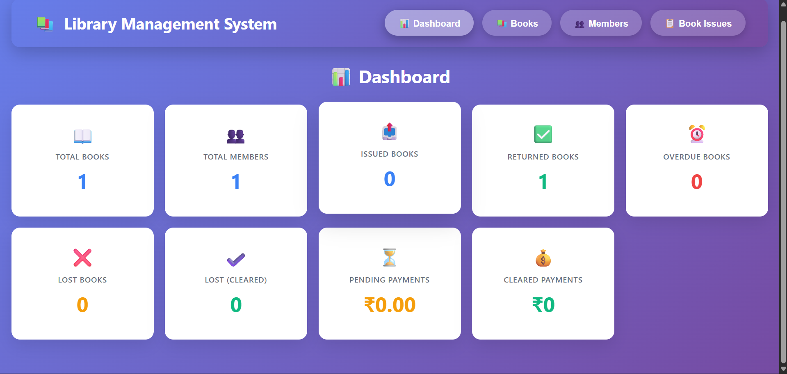
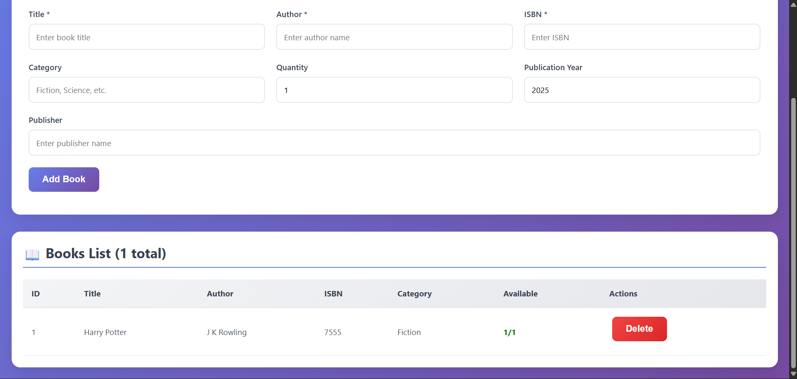
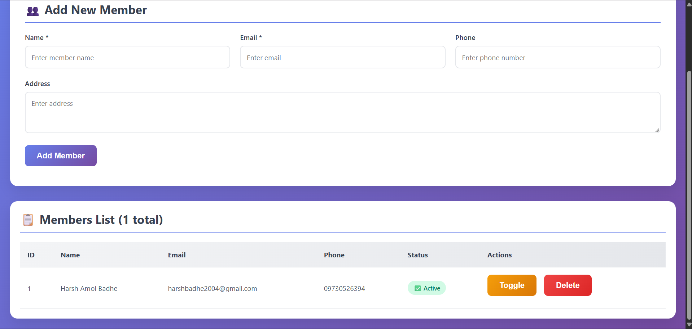

LibroCasa

Admin operation focused full-stack library management system.

Tech Stack used

Frontend - React.js, Axios, CSS3, HTML5
Backend - Node.js, Express.js, pg, cors
Database - PostgreSQL

Admin Dashboard

Add and display books in library

Add and display library members

Solve book issues

